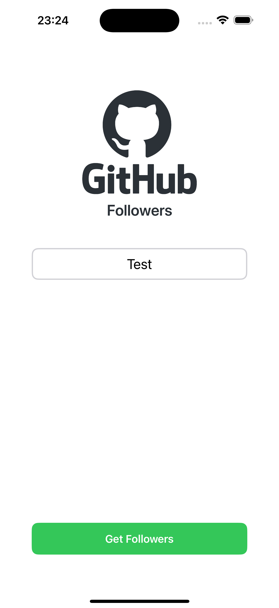
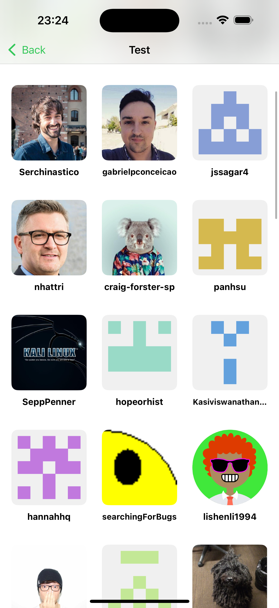
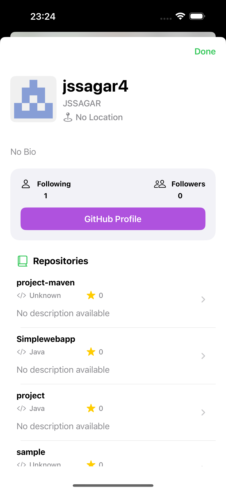
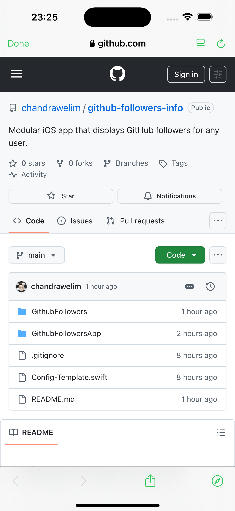

# GitHub Followers Info

A Swift iOS application for viewing GitHub user followers and repository information.

## 📱 Screenshots

<div align="center">
  
  
  
  
</div>

*From left to right: Search Screen, Followers List, User Profile with Repositories, GitHub Profile Integration*

### 🎯 Feature Showcase

1. **Search Interface**: Clean, minimalist search screen with GitHub branding and username input validation
2. **Followers Grid**: Responsive collection view displaying follower avatars with smooth scrolling and infinite pagination
3. **User Profiles**: Comprehensive user information including bio, location, follower/following counts, and repository listings
4. **GitHub Integration**: Seamless integration with GitHub.com through in-app Safari for viewing complete profiles

## Requirements

- Xcode 16
- iOS 18.0+
- Swift 5.0+
  
   

## Features

- Browse GitHub users and their followers
- View user profile information
- Display user repositories
- Clean, modern UI with snapshot testing
- **Dynamic Type support** for enhanced accessibility
- Modular architecture with separation of concerns

#### Accessibility Benefits
- Users with visual impairments can increase text size system-wide
- All text in the app automatically scales from extra small to accessibility extra large
- Maintains design proportions while ensuring readability
- Complies with iOS accessibility guidelines

## Configuration

This application requires a GitHub Personal Access Token to access the GitHub API.

### Setting up your GitHub Token

1. **Get a GitHub Personal Access Token**
   - Go to [GitHub Settings > Developer settings > Personal access tokens](https://github.com/settings/tokens)
   - Click "Generate new token"
   - Select the scopes you need (typically `public_repo` for public repositories)
   - Copy the generated token

2. **Configure the app**
   - Copy `Config-Template.swift` to `Config.swift`
   - Replace `"YOUR_GITHUB_TOKEN_HERE"` with your actual GitHub token
   - The `Config.swift` file is automatically ignored by git for security

3. **Example Config.swift**
   ```swift
   import Foundation

   public struct Config {
       public static let githubToken = "your_actual_github_token_here"
       public static let baseURL = "https://api.github.com"
   }
   ```

### Security Notes

- Never commit your actual GitHub token to version control
- The `Config.swift` file is excluded from git via `.gitignore`
- Use the `Config-Template.swift` as a reference for the expected structure

## Development

### Building the Project

1. Clone the repository
2. Configure your GitHub token (see Configuration section above)
3. Open `GithubFollowersApp.xcworkspace` in Xcode 16
4. Build and run the project

### Testing

The project includes unit tests and snapshot tests. To run tests:

1. Select the test target in Xcode
2. Press `Cmd+U` to run all tests

**Note**: This project was developed using Xcode 16. Snapshot test results may vary when using different Xcode versions or simulator configurations due to rendering differences.

**Important for Snapshot Testing**: Ensure your simulator language is set to English to match the CI environment:
- Go to `Simulator > Settings > General > Language & Region`
- Set the language to English and remove any other languages
- This ensures consistent snapshot test results across different environments

### Architecture

The project follows a modular architecture with clear separation of concerns:

- **GithubFollowers**: Core business logic and API layer
- **GithubFollowersiOS**: UI components and view controllers with Dynamic Type support
- **GithubFollowersApp**: App composition and dependency injection

### API Integration

The app integrates with the GitHub REST API to fetch:
- User follower lists
- User profile information
- User repository data

All API requests are authenticated using GitHub Personal Access Tokens.
